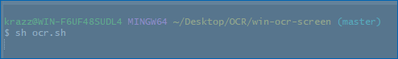

# Win OCR Screen


**Win OCR Screen** — небольшая утилита для создания снимков экрана и мгновенного оптического распознавания текста.



## Установка

```bash
pip install -r requirements.txt
```

## Запуск


```bash
python gui_app.py
```

При необходимости можно указать путь к Tesseract через переменную
`TESSERACT_PATH` и интерпретатор Python через `PYTHON_EXECUTABLE`.

Для быстрого запуска можно основаться на скриптах `ocr.sh` и `ocr.bat`.

## Горячие клавиши

- `Ctrl+Alt+O` — пуск или остановка программы.
- `Ctrl+Alt+P` — выход.

## Файлы

- `gui_app.py` — основное приложение с графическим интерфейсом и поддержкой горячих клавиш.
- `ocr_screen.py` — модуль выбора области экрана и передачи изображения в Tesseract.
- `starter.py` — пример запуска только через горячие клавиши.
- `ocr.sh` и `ocr.bat` — примеры скриптов для запуска.
- `requirements.txt` — зависимости Python.

## Задачи по улучшению

Для дальнейшего развития проекта можно рассмотреть следующие шаги:

- Отказаться от жёстко заданных путей к Python и Tesseract, перенести их в настройки.
- Промежуточные изображения сохранять временно или обрабатывать в памяти.
- Добавить обработку ошибок и логирование.
- Убрать лишние зависимости ("pyautogui") и создать `.gitignore`.
- Вынести процесс оптического распознавания в отдельный поток, чтобы не замедлять UI.

## Сборка `.exe`

Для создания автономного исполняемого файла под Windows можно использовать `PyInstaller`:

```bash
pip install pyinstaller
pyinstaller --noconsole --onefile gui_app.py
```

После сборки файл появится в каталоге `dist/`. Такой `.exe` можно запускать без установленного Python. При первом запуске программа создаст папку `app_data` рядом с `exe` и автоматически загрузит портативный пакет Tesseract. Отдельный дисплей для сборки не требуется, достаточно выполнить команды выше в консоли.
